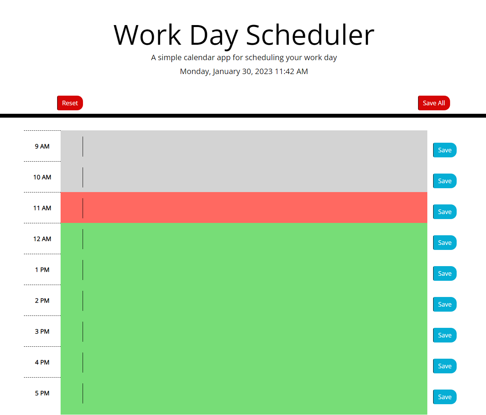
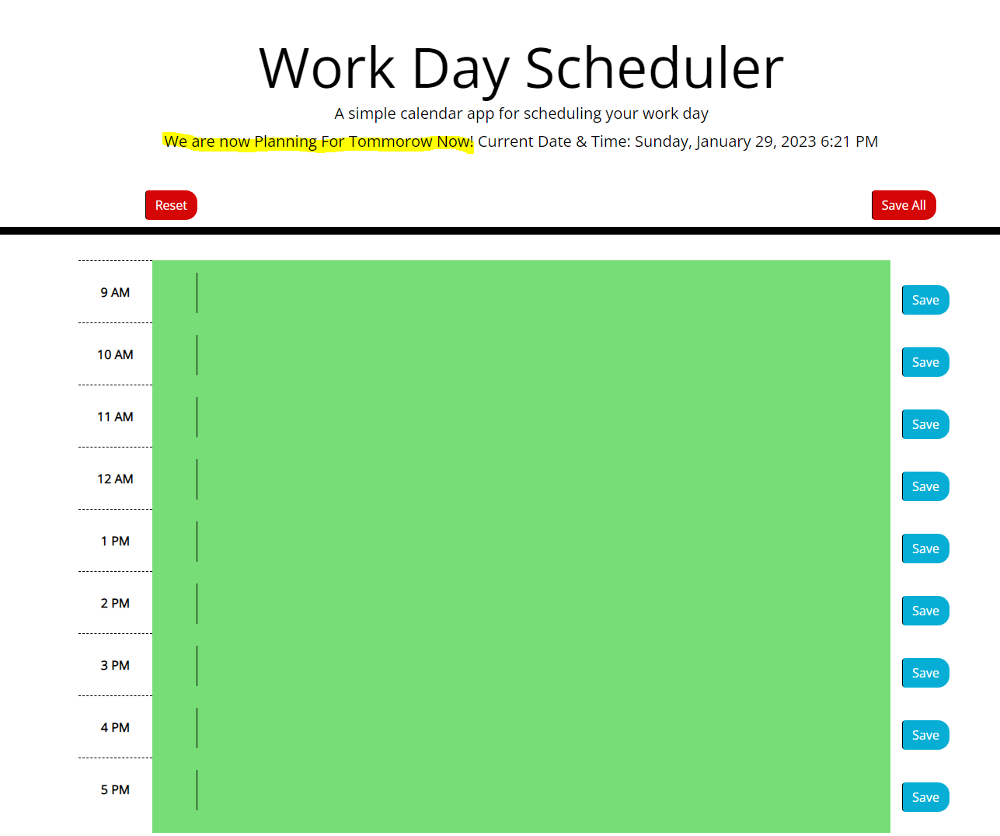
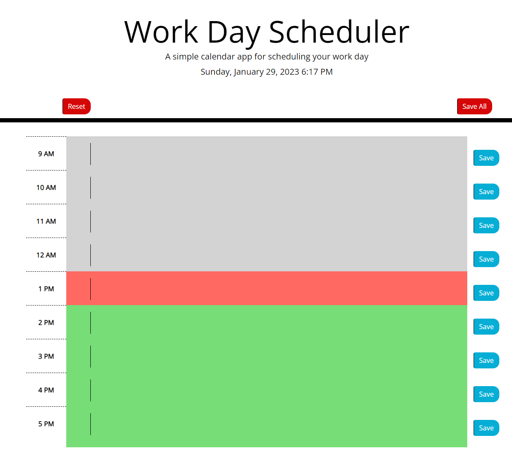

# **UoB Work Day Scheduler**

## **Introduction**

In this challenge we were requested to make a daily schedule for working hours, allowing the user to create, edit and save entries to the local storage. I have extended this challenge by adding a reset feature, which resets the whole schedule to blank, and also a save all so if you update all of the text areas instead of having to click save on each row, you can save all.

I have also added some additional logic, if the time is after 5pm or before 9am, it will report at the top of the screen, that you are planning the next working day. 

### **Testing Environment and Forcing the Hour**

I have also implemented Testing and Production Environments, which allow you to have additional debug informaiton into the console, and also you are able to force the tested hour during testing, so you can test every hour. To do this simply change the environment to T and the Hour to the hour you wish to test.

**Please be aware I have left it in Testing Environment and the hour forced will be 11am.**

## **To view this project**

Please visit the Git Page: <a href="https://ucstuart.github.io/UoBWorkDayScheduler/"> Here </a>

The REPO can also be found at: <a href="https://github.com/ucstuart/UoBWorkDayScheduler"> Here </a>

## **Screenshots**

Image showing 11am 

Image showing the behaviour outside the hours of 9am to 5pm, it shows that we are now planning the next day.

Testing image showing the time been tested as 1pm using the Test Environment, and forcing the hour to 13.

## **Important Notes**

**The project is in TESTING MODE and the FORCED hour will be 11am**

